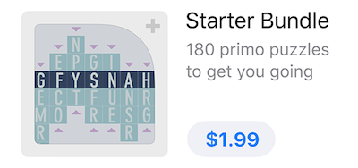

# InAppPurchase

[](https://travis-ci.org/jinSasaki/InAppPurchase)
[](https://github.com/Carthage/Carthage)
[](http://cocoapods.org/pods/InAppPurchase)
[](http://cocoapods.org/pods/InAppPurchase)
[](https://codecov.io/gh/jinSasaki/InAppPurchase)

A Simple, Lightweight and Safe framework for In App Purchase

## Feature

- Simple and Light :+1:
- Support [Promoting In-App Purchases](https://developer.apple.com/app-store/promoting-in-app-purchases/) :moneybag:
- No need to consider `StoreKit`! :sunglasses:
- High coverage and safe :white_check_mark:

## Installation

### Carthage

```txt
github "jinSasaki/InAppPurchase"
```

### CocoaPods

```ruby
pod "InAppPurchase"
```

## Usage

### Setup Observer

**NOTE: This method should be called at launch.**

```swift
let iap = InAppPurchase.default
iap.addTransactionObserver(fallbackHandler: {
    // Handle the result of payment added by Store
    // See also `InAppPurchase#purchase`
})
```

If you want to detect the unexpected transactions, pass `addTransactionObserver()` with `fallbackHandler`.  
For example, your app requested a payment, but it crashed in that process. That transaction is not finished, and then will receive at next launch.  
This `fallbackHandler` is called when any handlers are not set to `InAppPurchase` via `purchase(productIdentifier: handler:)` method and so on. 

#### Promoting In App Purchases is available from iOS 11. `InAppPurchase` supports it!

Add observer with `shouldAddStorePaymentHandler`.  
See also [`SKPaymentTransactionObserver#paymentQueue(_:shouldAddStorePayment:for:)`](https://developer.apple.com/documentation/storekit/skpaymenttransactionobserver/2877502-paymentqueue)and [Promoting In-App Purchases Guides](https://developer.apple.com/library/content/documentation/NetworkingInternet/Conceptual/StoreKitGuide/PromotingIn-AppPurchases/PromotingIn-AppPurchases.html#//apple_ref/doc/uid/TP40008267-CH11-SW1)



```swift
let iap = InAppPurchase.default
iap.set(shouldAddStorePaymentHandler: { (product) -> Bool in
    // Return whether starting payment
}, handler: { (result) in
    // Handle the result of payment added by Store
    // See also `InAppPurchase#purchase`
})
```

**:warning: Do not use `Product#priceLocale`**

Only if purchase via AppStore Promoting, `SKProduct#priceLocale` has been not initialized. It occurs a BAD_ACCESS crash. This is a StoreKit bug.
InAppPurchace resolved the crash that is occurred when received the payment, but it occurs when accessed `Product#priceLocale` yet.
So, I recommend not to use `Product#priceLocale` in AppStore Promoting Payment process.

#### Stop payment observing if needed.

```swift
let iap = InAppPurchase.default
iap.removeTransactionObserver()
```

### Fetch Product Information

```swift
let iap = InAppPurchase.default
iap.fetchProduct(productIdentifiers: ["PRODUCT_ID"], handler: { (result) in
    switch result {
    case .success(let products):
        // Use products
    case .failure(let error):
        // Handle `InAppPurchase.Error`
    }
})
```

### Restore Completed Transaction

```swift
let iap = InAppPurchase.default
iap.restore(handler: { (result) in
    switch result {
    case .success(let productIds):
        // Restored with product ids
    case .failure(let error):
        // Handle `InAppPurchase.Error`
    }
})
```

### Purchase

```swift
let iap = InAppPurchase.default
iap.purchase(productIdentifier: "PRODUCT_ID", handler: { (result) in
    // This handler is called if the payment purchased, restored, deferred or failed.

    switch result {
    case .success(let response):
        // Handle `PaymentResponse`
    case .failure(let error):
        // Handle `InAppPurchase.Error`
    }
})
```

### Transaction handling
If you want to handle the timing to complete transaction, set `shouldCompleteImmediately` to `false` at initializing.


```swift
let iap = InAppPurchase(shouldCompleteImmediately: false)
iap.purchase(productIdentifier: "PRODUCT_ID", handler: { (result) in
    // This handler is called if the payment purchased, restored, deferred or failed.

    switch result {
    case .success(let response):
        // Handle `PaymentResponse`
        // MUST: InAppPurchase does not complete transaction, if purchased, restored. Your app must call `InAppPurchase.finish(transaction:)`.
        if response.state == .purchased || response.state == .restored {
            iap.finish(transaction: response.transaction)
        }
    case .failure(let error):
        // Handle `InAppPurchase.Error`
    }
})

```

### Multiple instances of InAppPurchase
If you want to use multiple InAppPurchase, make each instance.  
**However, be careful the fallback handling because of duplicate handlings.**

This is duplicate handling example:

```swift
let iap1 = InAppPurchase.default
let iap2 = InAppPurchase(shouldCompleteImmediately: false)
iap1.addTransactionObserver(fallbackHandler: {
    // NOT CALLED
    // This fallback handler is NOT called because the purchase handler is used.
})
iap2.addTransactionObserver(fallbackHandler: {
    // CALLED
    // This fallback handler is called because the purchase handler is not associated to iap2.
})
iap1.purchase(productIdentifier: "your.purchase.item1", handler: { (result) in
    // CALLED
})

```

To avoid this situation, I recommend to **specify product IDs for each instance**.

```swift
let iap1 = InAppPurchase(shouldCompleteImmediately: true, productIds: ["your.purchase.item1", "your.purchase.item2"])
let iap2 = InAppPurchase(shouldCompleteImmediately: false, productIds: ["your.purchase.item3", "your.purchase.item4"])
iap1.addTransactionObserver(fallbackHandler: {
    // NOT CALLED
    // This fallback handler is NOT called because the purchase handler is used.
})
iap2.addTransactionObserver(fallbackHandler: {
    // NOT CALLED
    // This fallback handler is NOT called because "your.purchase.item1" is not specified for iap2.
})
iap1.purchase(productIdentifier: "your.purchase.item1", handler: { (result) in
    // CALLED
})

```

In addition, if you do not specify `productIds` or set `productIds: nil`, the iap instance allow all product ids.

## For Dependency Injection

The purchase logic in the App should be safe and testable. 

For example, you implemented a class to execute In-App-Purchase as follows.

```swift
// PurchaseService.swift

import Foundation
import InAppPurchase

final class PurchaseService {
    static let shared = PurchaseService()

    func purchase() {
        // Purchase with `InAppPurchase`
        InAppPurchase.default.purchase(productIdentifier: ...) {
            // Do something
        }
    }
}
```

It is hard to test this class because using the `InAppPurchase.default` in the purchase process.

This `PurchaseService` can be refactored to inject the dependency.  
Use `InAppPurchaseProvidable` protocol.

```swift
// PurchaseService.swift

import Foundation
import InAppPurchase

final class PurchaseService {
    static let shared = PurchaseService()

    let iap: InAppPurchaseProvidable

    init(iap: InAppPurchaseProvidable = InAppPurchase.default) {
        self.iap = iap
    }

    func purchase() {
        // Purchase with `InAppPurchase`
        iap.purchase(productIdentifier: ...) {
            // Do something
        }
    }
}
```

And then you can test `PurchaseService` easily with `InAppPurchaseStubs.framework`.

```swift
// PurchaseServiceTests.swift

import XCTest
@testable import YourApp
import InAppPurchaseStubs

// Test
final class PurchaseServiceTests: XCTestCase {
    func testPurchase() {
        let expectation = self.expectation(description: "purchase handler was called.")
        let iap = StubInAppPurchase(purchaseHandler: { productIdentifier, handler in
            // Assert productIdentifier, handler, and so on.
        })
        let purchaseService = PurchaseService(iap: iap)
        purchaseService.purchase(productIdentifier: ...) {
            // Assert result
            expectation.fulfill()
        }

        wait(for: [expectation], timeout: 1)
    }
}
```

If you want more information for test, see also [InAppPurchaseStubs](./InAppPurchaseStubs/Stubs/) and [Tests](./Tests/).

## Requirements

- iOS 9.0+
- Xcode 9+
- Swift 4+

## License

MIT
